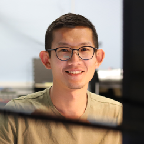

  

I am a PhD candidate at the Department of Electrical and Computer Engineering, UCLA.

My primary research topic focuses on the spatial autonomy of robots.

## news

<ul class="listing">
    
    <li>
        {{ piece.date  | dateFormat() | dateDisplay() }} 
         - {{ piece.event | safe }}
    </li>
    
</ul>

## contact me

tsangkaichang [at] ucla [dot] edu